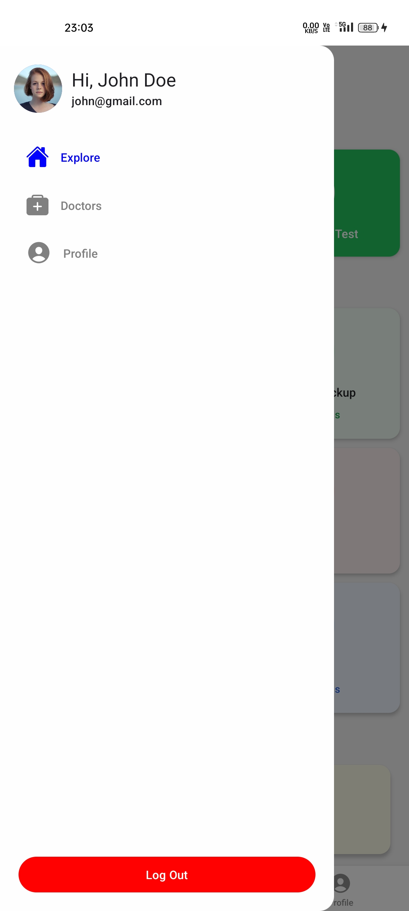
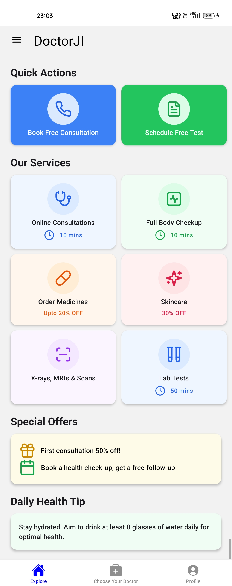
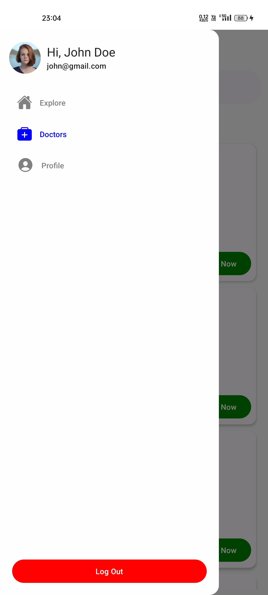
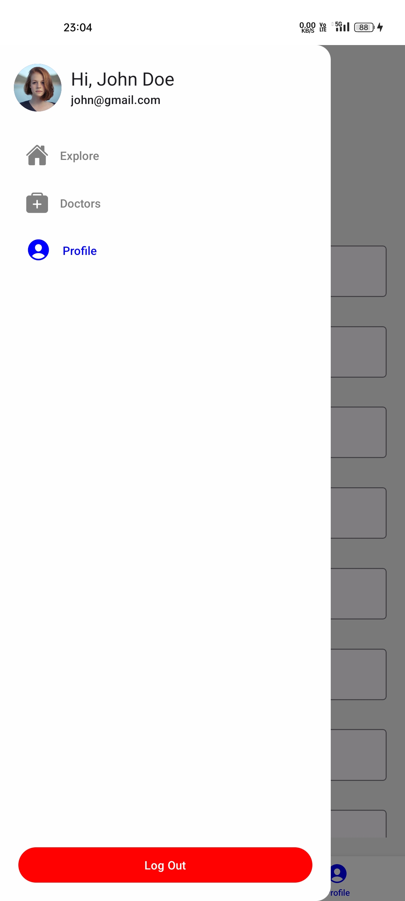
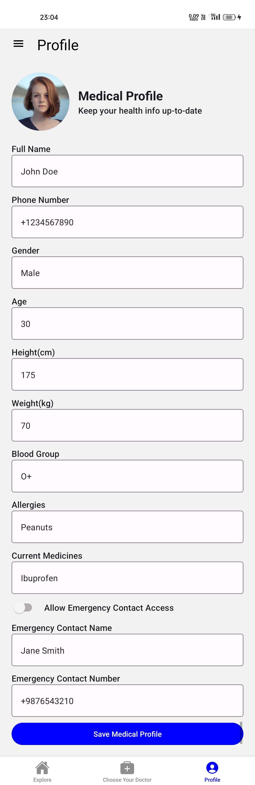

# DoctorJI

This React Native app is inspired by the MFine app and features side navigation, bottom navigation, a Home Screen, a Doctor Listing Screen, and Profile functionality. The app offers a responsive design for both iOS and Android platforms.


## 📱 Features

- **Home Screen**: 
  - Displays app logo and introduction.
  - Includes sections like "Consult a Doctor" and "Book Tests."
  - Bottom navigation for easy access to other screens.

- **Doctor Listing Screen**:
  - Displays a list of doctors with details like name, specialty, and image.
  - Supports navigation to view detailed information for each doctor.

- **Side Navigation Drawer**:
  - Links to Home, Doctor Listing, Profile, and Logout.

- **Profile Screen**:
  - Simple form to view and edit personal information.


## 🚀 Installation and Setup

1. **Clone the Repository:**
   ```bash
   git clone https://github.com/Prathamdas3/doctorji.git
   ```

2. **Change into folder:**
   ```bash
   cd doctorji
   ```

3. **Install Dependencies:**
   ```bash
   npm install 
   or
   pnpm install
   or 
   bun install
   ```

4. **Create a clean prebuild:**
   ```bash
   npx expo prebuild --clean
   or 
   bunx expo prebuild --clean
   or
   pnpm expo prebuild --clean
   ```

5. **Start on Emulator:**
   ```bash
   npm run android
   or 
   bun run android
   or 
   pnpm run android
   ```

## 🛠️ Technologies Used
1. React Native (via Expo)
2. Expo Router for navigation
3. TypeScript 
4. React Hooks: useState, useEffect, etc.

## 📸 Sample Screenshots


<div style="display:grid,grid-cols:2">






</div>


### Thank you for exploring the DoctorJI! 🚀
